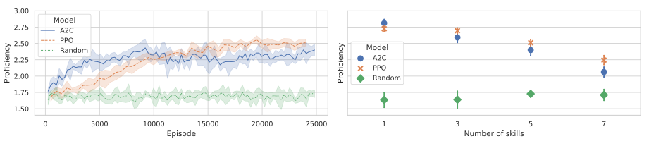

# Schooling-RL
This library contains the source code used in the publication _Can reinforcement learning agents be e-teachers? Application of machine learning in education_.
    
The main idea is to create an environment that imitates an e-learning platform in which students learn. In the system there is a database of tasks that students can solve as a learning process, and their results (solved or not) depends on the internal skills of a particular student.

Such an environment would allow for external interaction, which would involve the teacher (in our case, the RL Agent) being able to select tasks for students to maximize their final score on the exam. Such a teacher has to learn which tasks develop given skills, their level of difficulty, and the student's ability only from information about the results of the tasks.

In the image below, we can see the growth of students' average intrinsic proficiency over time as the teacher advances (students learn from the beginning in each epoch). Detailed explanations of what is in the plots and how it was calculated can be found in the publication.



### Installation
Simply clone the repository and then install the dependencies:

```bash
pip install -r requirements.txt
```

Now, you should be able to run example training by typing:

```bash
python3 src/example_run.py --skills_quantity 3 --time_to_exam 25 --max_steps 2000  
```

More advanced uses of the algorithms, and the parameters used during the benchmarks in publication can be found in:

```bash
src/benchmarks/run_benchmarks.py
```

In order to format code run:

```bash
black src
```

To run unit tests:

```bash
pytest
```

### Citation:
```
TODO
```
